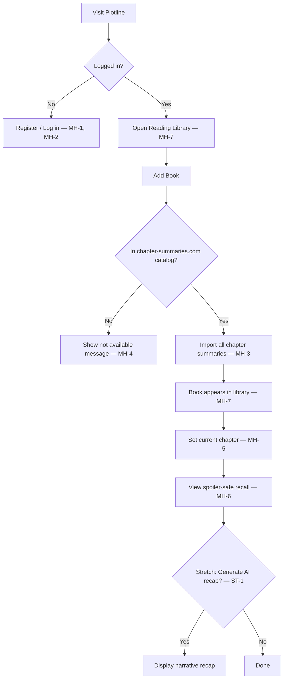
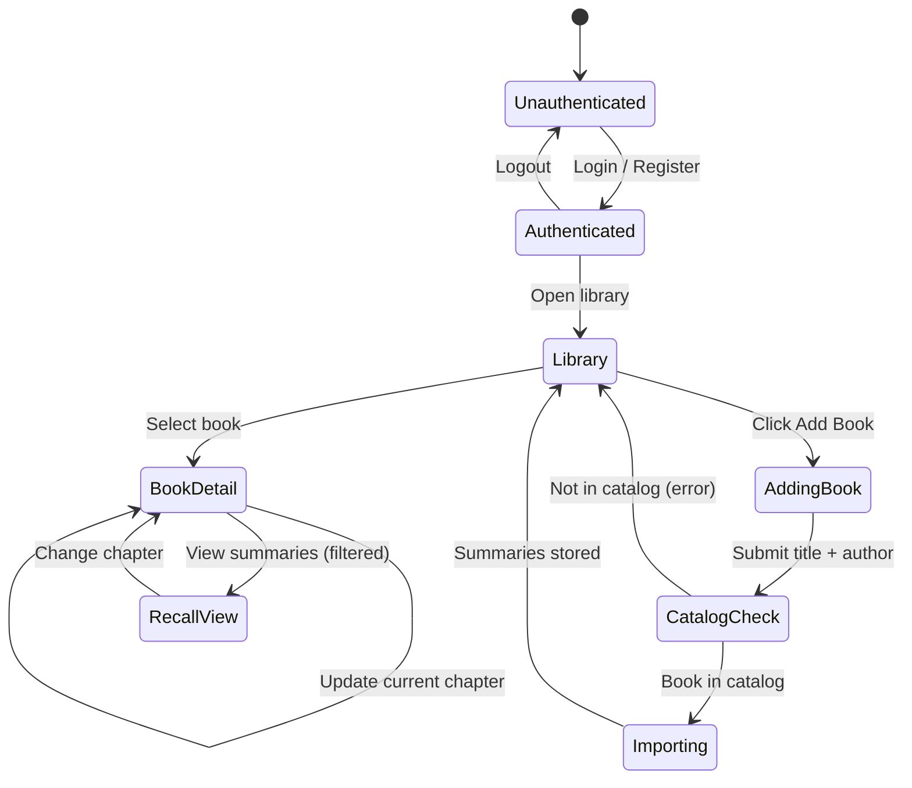

# Plotline — Requirements Specification

**CSE 499 Senior Project**

| | |
|---|---|
| **Project Name** | Plotline |
| **Team Members** | Thomas Lucas |
| **Date** | June 6, 2026 |
---

## Section 3: Overview of the Product

### Workflow

The primary user workflow maps directly to must-have requirements:



| Workflow Step | Requirements |
|---|---|
| Account creation | MH-1 |
| Login / logout | MH-2 |
| Add book + import | MH-3, MH-4 |
| Track progress | MH-5 |
| View recall | MH-6 |
| Library view | MH-7 |
| AI recap (optional) | ST-1 |
| Catalog browse (optional) | ST-2 |
| Hardcover search (optional) | ST-3 |
| Live progress refresh (optional) | ST-4 |

---

### Resources

| Resource | Role in Product |
|---|---|
| **Elixir / OTP** | Core application language and runtime |
| **Phoenix + LiveView** | Web server, routing, real-time UI |
| **PostgreSQL** | Persistent storage for users, books, progress, summaries |
| **Ecto** | Database schemas, queries, migrations |
| **Req** | HTTP client for fetching summary pages and catalog |
| **chapter-summaries.com** | Primary source for chapter summary text (~97 books) |
| **Hardcover API** *(stretch)* | Book metadata and cover images for discovery |
| **OpenAI / LLM API** *(stretch)* | Recap narrative generation from stored summaries |
| **phx.gen.auth** | User authentication (registration, login, sessions) |
| **ExUnit** | Automated testing |

**Architecture:** Client/server, multi-tier web application.

| Tier | Technology |
|---|---|
| Presentation | Phoenix LiveView (HTML over WebSocket) |
| Application / Business Logic | Elixir contexts (`Books`, `Summaries`, `UserBooks`, `Extraction`) |
| Data | PostgreSQL via Ecto |

**How parts interconnect:**

1. **Catalog** syncs the chapter-summaries.com book list to a local JSON file for fast availability checks.
2. **Extraction adapters** fetch and parse summary text from external sites; one adapter per source website.
3. **Summaries context** stores imported text in `chapter_summaries` and filters by chapter on read.
4. **UserBooks context** tracks per-user reading progress.
5. **LiveView pages** orchestrate user actions and display filtered results.

---

### Data at Rest

All persistent data is stored in **PostgreSQL**.

| Table | Contents |
|---|---|
| `users` | Email, hashed password, confirmation timestamp (auth) |
| `books` | Title, author, total chapters, chapter_summaries_slug, optional Hardcover ID |
| `user_books` | User ID, book ID, `current_chapter_number` (reading progress) |
| `chapter_summaries` | Book ID, chapter number, summary text, source name, source URL, scraped timestamp |

**Local files (non-user):**

| File | Contents |
|---|---|
| `priv/data/chapter_summaries_catalog.json` | Cached list of ~97 books available on chapter-summaries.com |
| `priv/data/extraction/*.json` | Optional curated offline demo summaries |

User profile data (login credentials) and application data (books, progress, summaries) are never stored in flat files for runtime use — only the catalog cache is a JSON file for performance.

---

### Data on the Wire

| Communication | Protocol | Data Sent |
|---|---|---|
| Browser ↔ Phoenix server | HTTPS, WebSocket (LiveView) | HTML, form submissions, LiveView events |
| Server ↔ PostgreSQL | TCP (Ecto/Postgrex) | SQL queries |
| Server ↔ chapter-summaries.com | HTTPS (Req) | HTML pages (one fetch per book on import; catalog sync periodically) |
| Server ↔ Hardcover API *(stretch)* | HTTPS | Book search metadata (JSON) |
| Server ↔ LLM API *(stretch)* | HTTPS | Filtered summary text in; recap narrative out |

Summary import happens **once on book add** on the server. The browser never receives summary text from chapters beyond the user’s current chapter. AI recap requests (stretch) send only pre-filtered, spoiler-safe text to the external API.

---

### Data State



**Spoiler safety rule (applied at read time):**

```
visible_summaries = all summaries WHERE chapter_number <= user.current_chapter_number
```

---

### HMI / HCI / GUI

Plotline uses a browser-based responsive web interface built with Phoenix LiveView and Tailwind CSS.

**Planned screens:**

| Screen | Purpose |
|---|---|
| Home | Landing page with login/register links |
| Login / Register | Account access |
| Reading Library | List of user’s books with progress |
| Add Book | Title/author entry or catalog search; availability feedback |
| Book Detail | Current chapter selector, recall display, optional “Generate Recap” |
| Settings | Account management (from phx.gen.auth) |

**Wireframe — Reading Library (text layout):**

```
┌─────────────────────────────────────────────────┐
│  Plotline                        [Settings] [Logout] │
├─────────────────────────────────────────────────┤
│  My Library                    [+ Add Book]     │
│                                                 │
│  ┌─────────────────────────────────────────┐   │
│  │ The Strength of the Few               │   │
│  │ James Islington · Chapter 12 of 80      │   │
│  └─────────────────────────────────────────┘   │
│  ┌─────────────────────────────────────────┐   │
│  │ Pride and Prejudice                     │   │
│  │ Jane Austen · Chapter 5 of 61           │   │
│  └─────────────────────────────────────────┘   │
└─────────────────────────────────────────────────┘
```

**Wireframe — Book Detail with Spoiler-Safe Recall:**

```
┌─────────────────────────────────────────────────┐
│  ← Back to Library                              │
│  The Strength of the Few · James Islington      │
│                                                 │
│  Current chapter: [ 12 ▼ ]  [Update]            │
│                                                 │
│  ── Recall (Chapters 1–12) ──                   │
│  Chapter 1: Fleeing through a blood-soaked...   │
│  Chapter 2: Still reeling from the chaotic...   │
│  ...                                            │
│  Chapter 12: ...                                │
│  (Chapters 13–80 hidden)                        │
│                                                 │
│  [Generate Recap]  ← stretch                    │
└─────────────────────────────────────────────────┘
```

*Note: Screenshots will be added to the final submission once LiveView pages are built.*

---

## Section 4: Verification

### Demo Plan

**Environment:** Local development (`mix phx.server`) or deployed instance with PostgreSQL.

**Demo data:**

| Book | Author | Chapters | Purpose |
|---|---|---|---|
| *The Strength of the Few* | James Islington | 80 | Primary demo — large chapter count |
| *Pride and Prejudice* | Jane Austen | 61 | Secondary demo — classic title |
| *Dune* | Frank Herbert | — | Negative test — not in catalog |

**Demo script (must-haves):**

1. Register a new user account (MH-1).
2. Log out and log back in (MH-2).
3. Add *The Strength of the Few* — confirm 80 chapters imported (MH-3).
4. Attempt to add *Dune* — confirm rejection message (MH-4).
5. Set current chapter to 5 — confirm saved (MH-5).
6. Open recall — verify only chapters 1–5 visible (MH-6).
7. Return to library — verify both attempted books show correctly (only supported book listed) (MH-7).
8. *(Stretch)* Generate AI recap, browse catalog, or demo LiveView refresh.

---

### Testing Plan

| Requirement | Verification Method | Acceptable Range | Failure Condition |
|---|---|---|---|
| MH-1 Registration | Manual demo + ExUnit test on `Accounts.register_user/1` | Valid email/password creates user; duplicate email rejected | Registration fails silently or accepts invalid email |
| MH-2 Login/Logout | Manual demo + existing `UserLive.LoginTest` | Login succeeds; logout clears session; protected routes blocked | Session persists after logout or wrong user shown |
| MH-3 Book import | Manual demo + `ChapterSummariesTest` (external tag) | Imported count equals source chapter count; summaries non-empty | Zero summaries stored or import crashes |
| MH-4 Catalog rejection | Manual demo + unit test on `Books.add_book_with_summaries!/1` with unknown title | `{:error, :not_in_catalog}` returned; no book in library | Unsupported book added with empty summaries |
| MH-5 Progress tracking | Manual demo + `UserBooksTest` | Chapter saves, persists on reload, validates bounds | Invalid chapter accepted or progress lost on reload |
| MH-6 Spoiler filter | Manual demo + `Summaries.get_summaries_up_to/2` test | Returned list max chapter = current chapter | Any summary with chapter_number > current visible |
| MH-7 Library view | Manual demo + LiveView test | All user books listed with correct metadata | Missing books or wrong progress shown |
| ST-1 AI recap | Manual demo | Recap generated; no post-current-chapter spoilers in output | AI called with full book text or recap includes spoilers |
| ST-2 Catalog browse | Manual demo | Search returns catalog matches | Search broken or non-catalog books shown as addable |
| ST-3 Hardcover | Manual demo | Metadata pre-fills from API response | API error crashes add flow |
| ST-4 LiveView refresh | Manual demo | Recall updates without full page reload | Full page reload required to see new chapters |

**Automated tests:** Run `mix test` before each demo. Current suite: 131 tests passing (as of Week 7). Live import test tagged `:external` verifies MH-3 backend; UI tests will be added as LiveViews are built.

---

## Sources / Citations / Resource Links

| Resource | URL | Use |
|---|---|---|
| chapter-summaries.com | https://chapter-summaries.com/ | Primary chapter summary source |
| chapter-summaries.com catalog | https://chapter-summaries.com/books/ | Book availability list (~97 titles) |
| Phoenix Framework | https://hexdocs.pm/phoenix/overview.html | Web framework documentation |
| Phoenix LiveView | https://hexdocs.pm/phoenix_live_view/ | Real-time UI |
| phx.gen.auth | https://hexdocs.pm/phoenix/mix_phx_gen_auth.html | Authentication generator |
| Ecto | https://hexdocs.pm/ecto/Ecto.html | Database layer |
| Req HTTP client | https://hexdocs.pm/req/ | HTTP requests for extraction |
| Hardcover API | https://hardcover.app/ | *(Stretch)* Book metadata |
| Elixir lang | https://elixir-lang.org/ | Programming language |
| PostgreSQL | https://www.postgresql.org/ | Database |

**Project documentation:**

- [context.md](context.md) — project status and codebase overview
- [decisions.md](decisions.md) — design decisions (adapters, catalog, storage)
- [weekly-log.md](weekly-log.md) — Week 7 progress log
- [PHOENIX_GUIDE.md](PHOENIX_GUIDE.md) — Phoenix structure and schema guide

---